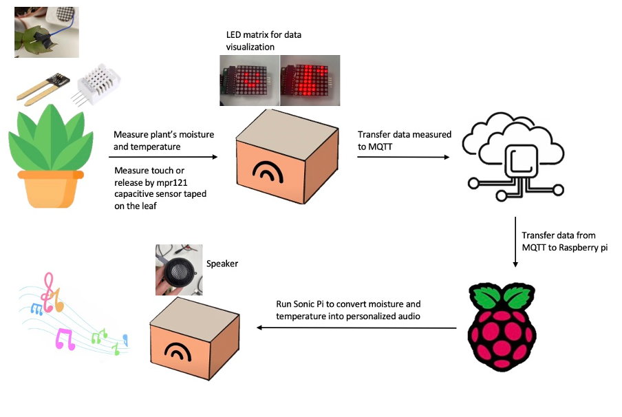
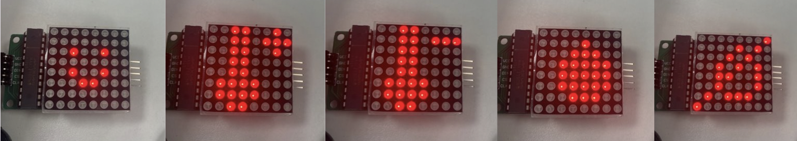
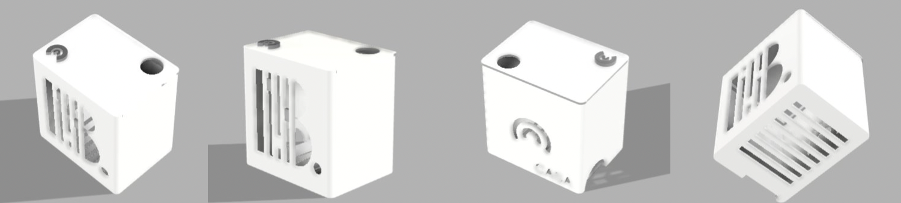

# InFloreSense: Visualised and Sonified Plant Data

[GitHub Repo](https://github.com/Lalalaconcerto/InFloreSense)

## Problem

Plants can be difficult to take care of. Shortly after purchase, plants frequently die due to overwatering (Vanzile 2021). Plants also often die due to underwatering after the novelty of the new plant wears off, with Art Markman of the University of Texas attributing this issue to a lack of reminders (Bregel 2019). More experienced plant-owners, such as florist Liz Vayda, recommend that the best way to become a better plant caretaker is to simply learn more about the plants and pay attention to them (Bregel 2019).

While existing plant monitors will give information about the current needs of a plant, the data they provide is either overly simplified or difficult to interpret. Additionally the data is only accessible via a visual interface. By providing data that is overly simplified, these plant monitors do not allow plant owners to develop their own intuitive sense of their plants’ needs. Providing data that is difficult to interpret can prevent the data from being acted on, potentially causing the plant owner to ignore the data completely. Lastly, the visual-only interfaces make plant monitors inaccessible to blind or hard-of-sight plant-owners.

## Motivation

Infloresense helps less experienced plant-owners keep their plants alive without stifling the learning process in which they develop an intuition for how to take care of their plants. Our device combines visual indicators of the general conditions of the plant with a sound-based mapping that expresses the conditions of the plant in more detail. By combining the visual dashboard with sonification, Infloresense will stoke curiosity in all plant-owners as they discover how the sound changes due to subtle changes in the plants’ conditions and understand what sounds indicate a healthy plant. Additionally, it makes our device accessible for blind plant-owners, who can rely solely on the sonification in understanding the plant's conditions.

## Inspiration

Having previous experience developing a standard plant monitor, our project was chiefly inspired by sonification works. Mogees is a discontinued device that would adhere to any surface, including that of trees, and by connecting to an iPhone, it would map any vibrations on that surface to a custom instrument chosen by the user. We were inspired by the way this project allowed for co-creation of music between a user and the natural environment. Ototo, a microcontroller-based device that connected to everyday objects as keys and modulators of a synthesiser, inspired us in its approach of being self-contained and not requiring a mobile phone to function. Lastly, we were inspired by the work of Mileece. Mileece attaches electrodes to plant leaves, turning voltage differences between the leaves into ambient music. We were inspired by her approach of connecting the leaves of the plant to her electronic instrument.

## Documentation of Prototyping Process

### Initial Design

We initially planned to visualise and sonify the voltage signals produced by a plant. This required significant voltage amplification, but was able to recognise water input or rustling of leaves when developed as a standalone circuit​. However, the data was too noisy to capture these stimuli when other modules were attached to the Arduino​. Thus, this option was not selected for this project.

### Second Design

#### User Interface

Instead of measuring intra-plant voltage, we pivoted to visualising and sonifying moisture and temperature plant data using a leaf as the user interface​: we used a leaf as a touch sensor to trigger the data to be revealed to a user. The plant’s needs were expressed visually with an 8x8 pixel matrix and auditorily with a choral voice and bass drum. We sonified the full temperature and moisture range that could be expected, allowing our users to develop an intuition for the plant’s exact conditions from listening to the audio. The flow chart of the project is shown below.

  
#### Moisture sensing

Capacitive soil moisture sensor can measure the soil moisture distrectly. The main component of the sensor is the humidity sensitive capacitor and the number of absorbed water changes with the change in ambient humidity(Boudaden,et,al,2018). By measuring the capacitance value, it can be converted into a humidity value. The soil moisture value can be directly read using the digital pin of the Arduino.

#### Temperature Sensing

DHT-22 can measure ambient temperature. The principle of DHT22 measuring temperature and humidity is to measure the surrounding air through the built-in capacitive humidity sensor and thermistor(Kim,et al, 2021). After obtaining the temperature and humidity values, a digital signal is sent to the main control board from the Data pin.

#### Touch Sensing

MPR 121 capacitive touch sensor can handle up to 12 individual touch pads. Each pin can be connected to wires and be taped to leaves as a touch switch(Ada,et al,2022). We programmed it with the Arduino MPR121 library so that touch will set LED matrix and speaker on, and release will set LED matrix and speaker off.

#### Visualisation

The LED matrix consists of 64 red LEDs. Some simple images were displayed with five different icons to show different conditions of the plant. These icons are shown below; from left to right, they correspond to healthy conditions, high temperature, low temperature, overly moist soil, and overly dry soil​. Every time you touch a leaf, the icon will show the current conditions until 5 seconds after your finger has been removed. If neither humidity nor temperature are in the correct range, humidity and temperature icons will be alternately displayed on the LED matrix for one second. If one metric is in a good range, then the matrix will exclusively show the icon representing the metric that needs to be changed. If both conditions are good, the smiling icon will be shown.

#### Data flow to Raspberry Pi

Moisture data, temperature data, and touch data are sent once per second to an MQTT server in a channel labelled "Infloresense". A continuously-running Python script on the Raspberry Pi monitors the MQTT data feed from the “Infloresense” channel, and stores the values in a plain text file, resetting the plain text file every second. Simultaneously, a shell script repeatedly runs runs a Sonic Pi script via a Python-based command line interface, using the plain text file as an input parameter.

#### Sonification

Sonic Pi plays two sound samples synchronously, a choral voice and a bass drum. These two samples are sped up according to the amount of moisture in the soil and temperature of the surrounding environment, respectively. Different continuous functions are used to ensure that the full range of realistic moistures and temperatures is sonified in a distinguishable and musical manner. We have specifically tied higher moisture and temperature levels to more sped up versions of the two instruments.

#### Enclosure

Before designing the enclosure, we measured the dimensions of each part individually to create a compact enclosure. However, we found that with wire connections, a larger enclosure was needed. See below for a final rendering of our enclosure.

##### Model design

We used Fusion360 to design the enclosure. For future prototypes, we expect simulating the placement of all of the components inside the enclosure will help us to design the most spatially-efficient enclosure.

##### Wires outlet

Multiple wires need to come out of the enclosure to connect to external devices, including the charging cable for Arduino, the charging cable for a Raspberry Pi, the cable connecting the touch sensor and the cable connecting the soil moisture sensor. For this, we designed some gaps to let these wires come out of the enclosure. These gaps are designed to emulate the appearance of a sound mixer.

##### Heat dissipation

When placed in the first prototype enclosure, the Arduino and Raspberry Pi microcontrollers were found to be hot which distorted the readings of the DHT-22 sensor. To solve this problem, we added a strip-shaped gap at the bottom of the box to dissipate heat.

## Critical Reflection and Future Improvements

### All-in-one design

Currently, our device is separate from the plant, with wires exposed on the outside of the enclosure. In the future, we will design an enclosure to put all the components inside, including the plant.

### Power supply

The Raspberry Pi and Arduino board are currently powered by different external power supplies. In the future, we will place a small power strip in the enclosure to connect the two boards with an external power supply in a more consolidated manner.

### Audio hardware design

We put the speaker and other components directly into the enclosure, but this leads to poor speaker sound. If amplification could be incorporated into the outside of the enclosure, it would improve the musical quality. We are interested in testing out a thin-film loudspeaker adhered to the surface of the enclosure, as recently developed by researchers at MIT (Han, Lang, and Bulovic 2022).

### Leaf touch interface

The touch sensor is wired in a way that does not hide the wire and usually requires the user to pinch it in order to turn on InfloreSense's visualisations. To make the user interaction feel more organic, we would like to explore using an electrode pad to detect a touch to any portion of a leaf.

### More channels

Right now we only use one touch sensor. If more than one channel to connect to different leaves is used, more interesting music could be produced, based on either other parameters relating to the care of the plant, or even combining the plant's data with external sustainability or environmental data (such as the user's electricity usage, the air pollution forecast in one's neighbourhood that day, or the chance of rain).

### Accessibility

To make our device more accessible to hard-of-sight individuals, it would be worth adding an "audio-only" mode, potentially by using a wake-word to get InfloreSense to say its needs before playing the sonification until it is told to stop.

## References

Boudaden, J. _et al._ (2018) ‘Polyimide-Based Capacitive Humidity Sensor’, _Sensors_, 18(5), p. 1516. doi:10.3390/s18051516.

Bregel, S. (2019) ‘Perspective | Why I can’t take care of a plant’, _Washington Post_, 5 July. Available at: https://www.washingtonpost.com/outlook/why-i-cant-take-care-of-a-plant/2019/07/05/ee961b54-9788-11e9-8d0a-5edd7e2025b1_story.html (Accessed: 3 May 2022).

Dentaku (2014) _Ototo: Make Music from Anything_, _Kickstarter_. Available at: https://www.kickstarter.com/projects/905018498/ototo-make-music-from-anything (Accessed: 3 May 2022).

Fried, L. (2014) ‘Adafruit MPR121 12-Key Capacitive Touch Sensor Breakout Tutorial’, _Adafruit Learning System_, 25 July. Available at: https://learn.adafruit.com/adafruit-mpr121-12-key-capacitive-touch-sensor-breakout-tutorial/wiring (Accessed: 5 May 2022).

Han, J., Lang, J.H. and Bulović, V. (2022) ‘A Thin-Film Piezoelectric Speaker Based On An Active Microstructure Array’, in 2022 IEEE 35th International Conference on Micro Electro Mechanical Systems Conference (MEMS). 2022 IEEE 35th International Conference on Micro Electro Mechanical Systems Conference (MEMS), pp. 852–855. doi:10.1109/MEMS51670.2022.9699609.

Hermann, T., Hunt, A. and Neuhoff, J.G. (2011) ‘The Sonification Handbook’, p. 586.

Kim, J. _et al._ (2021) ‘Capacitive Humidity Sensor Based on Carbon Black/Polyimide Composites’, _Sensors_, 21(6), p. 1974. doi:10.3390/s21061974.

Mogees (2015) _Mogees - Play the World_. Available at: https://www.youtube.com/watch?v=G_hBhORGE6Y (Accessed: 26 April 2022).

Mogees (2016) _Mogees - Transform anything into a musical instrument._, _Kickstarter_. Available at: https://www.kickstarter.com/projects/mogeesplay/mogees (Accessed: 3 May 2022).

Motherboard (2014) _Meet the Sonic Artist Making Music with Plants: Sound Builders_. Available at: https://www.youtube.com/watch?v=wYU18eiiFt4 (Accessed: 3 May 2022).

Palmai, K. (2022) ‘How smart sensors can help us care for our houseplants’, _BBC News_, 21 February. Available at: https://www.bbc.com/news/business-60387006 (Accessed: 3 May 2022).

Vanzile, J. (2021) ‘Learn How to Not Kill Your Houseplants With Too Much Water’, _The Spruce_, 19 December. Available at: https://www.thespruce.com/tips-for-watering-houseplants-1902807 (Accessed: 3 May 2022).
